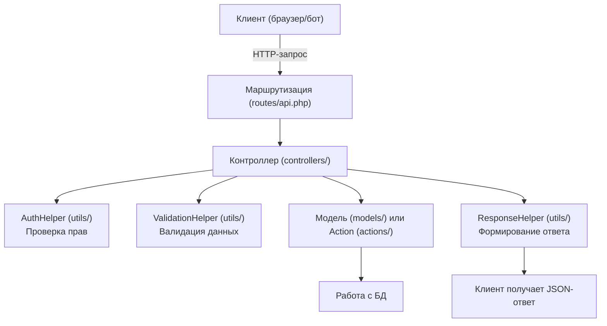

# Структура backend CabrioRide

Данный каталог содержит весь серверный код проекта CabrioRide. Ниже приведена рекомендуемая структура файлов и папок с пояснениями.

```
backend/
│
├── controllers/                # Контроллеры — основные обработчики HTTP-запросов (REST и RPC)
│   ├── UserController.php          # Пользователи: CRUD, профиль, действия с пользователем
│   ├── CarController.php           # Автомобили: CRUD, действия с авто
│   ├── EventController.php         # События: CRUD, участие, приглашения
│   ├── GuideObjectController.php   # Гид-объекты: CRUD, модерация
│   ├── ReviewController.php        # Отзывы: CRUD, модерация
│   ├── MapHintController.php       # Подсказки на карте: CRUD
│   ├── BusinessCardController.php  # Визитки: CRUD
│   ├── PhotoController.php         # Фото: загрузка, удаление, получение
│   ├── ReferenceController.php     # Справочники: роли, статусы, типы и т.д.
│   ├── AuthController.php          # Авторизация, сессии, выход
│   ├── ActivityController.php      # Активность пользователя: выдача, история
│   └── MeController.php            # Информация о текущем пользователе ("/me")
│
├── actions/                    # Классы для сложных действий (RPC, бизнес-логика)
│   ├── Car/
│   │   └── TransferOwnershipAction.php    # Передача авто другому пользователю
│   ├── User/
│   │   ├── ApproveUserAction.php         # Подтверждение пользователя (модерация)
│   │   ├── BlockUserAction.php           # Блокировка пользователя
│   │   └── UnblockUserAction.php         # Разблокировка пользователя
│   ├── Event/
│   │   ├── InviteUserAction.php          # Приглашение на событие
│   │   └── ConfirmParticipantAction.php  # Подтверждение участия
│   ├── GuideObject/
│   │   └── ApproveGuideObjectAction.php  # Модерация гид-объекта
│   └── Review/
│       └── ApproveReviewAction.php       # Модерация отзыва
│
├── models/                     # Модели — работа с БД, структура данных
│   ├── User.php                    # Модель пользователя
│   ├── Car.php                     # Модель автомобиля
│   ├── Event.php                   # Модель события
│   ├── GuideObject.php             # Модель гид-объекта
│   ├── Review.php                  # Модель отзыва
│   ├── MapHint.php                 # Модель подсказки на карте
│   ├── BusinessCard.php            # Модель визитки
│   ├── Photo.php                   # Модель фото
│   ├── Role.php                    # Модель роли (справочник)
│   ├── Status.php                  # Модель статуса (справочник)
│   └── ...                         # Другие модели по необходимости
│
├── routes/
│   └── api.php                 # Файл маршрутов: связывает URL с методами контроллеров
│
├── utils/                      # Вспомогательные классы и функции
│   ├── ResponseHelper.php          # Формирование стандартных ответов API
│   ├── AuthHelper.php              # Проверка авторизации, ролей, токенов
│   ├── ValidationHelper.php        # Валидация входных данных
│   ├── Database.php                # Подключение к базе данных через параметры из .env (Singleton)
│   └── ...                        # Другие утилиты по необходимости
│
├── docs/                       # Вся документация по backend
│   ├── CONVENTIONS.md              # Стандарты и правила для backend
│   ├── ENDPOINTS.md                # Полный перечень эндпоинтов
│   ├── ENVIRONMENT.md              # Переменные окружения
│   └── openapi.yaml                # OpenAPI спецификация
├── _tests/                     # Интеграционные тесты backend
│   └── README.md                   # Оглавление и инструкция по тестам
└── README.md                   # Краткое описание структуры backend, ссылки на документацию
```

---

## Документация backend

### Основная документация
- [Стандарты и соглашения (CONVENTIONS.md)](docs/CONVENTIONS.md)
- [Эндпоинты API (ENDPOINTS.md)](docs/ENDPOINTS.md)
- [Переменные окружения (ENVIRONMENT.md)](docs/ENVIRONMENT.md)
- [OpenAPI спецификация (openapi.yaml)](docs/openapi.yaml)

### Новая документация
- [Коды ошибок API (ERROR_CODES.md)](docs/ERROR_CODES.md)
- [Развёртывание (DEPLOYMENT.md)](docs/DEPLOYMENT.md)
- [Безопасность (SECURITY.md)](docs/SECURITY.md)
- [Тестирование (TESTING.md)](docs/TESTING.md)
- [Производительность (PERFORMANCE.md)](docs/PERFORMANCE.md)

### Архитектура и зависимости
- [Модели (MODELS.md)](docs/MODELS.md)
- [Зависимости (DEPENDENCIES.md)](docs/DEPENDENCIES.md)
- [Диаграмма зависимостей (DEPENDENCIES_DIAGRAM.md)](docs/DEPENDENCIES_DIAGRAM.md)

## Тесты backend

- [Оглавление и инструкция по тестам](../backend/_tests/README.md)
- Все интеграционные тесты размещаются в каталоге _tests/

---

## Схема движения запроса по backend



**Пояснения:**
- Каждый прямоугольник — отдельный слой или компонент backend.
- Стрелки показывают последовательность обработки запроса.
- Проверка прав и валидация данных происходят в начале контроллера через helpers.
- Модель или action работают с базой данных.
- Ответ всегда формируется через ResponseHelper и возвращается клиенту в едином формате.

---

## Database.php — подключение к БД

Класс Database инкапсулирует подключение к MySQL через PDO. Все параметры берутся из файла .env в корне проекта.

**Пример использования:**

```php
$pdo = Database::getInstance();
$stmt = $pdo->prepare("SELECT * FROM users WHERE id = ?");
$stmt->execute([$id]);
$user = $stmt->fetch();
```

- Класс реализует паттерн Singleton: подключение создаётся один раз на весь запрос.
- Не храните параметры подключения в коде — только в .env!

---

## Архитектура фронтенда и бэкенда

- На текущем этапе фронтенд (WebApp) и бэкенд размещаются на одном домене:
  - Backend API: https://cabrioride.by/app/backend/api
  - Frontend:    https://cabrioride.by/app/frontend/
- Это позволяет избежать необходимости настройки CORS и упростить интеграцию.
- В будущем, если фронтенд будет вынесен на отдельный поддомен, потребуется добавить CORS-заголовки на backend (см. раздел "CORS" в документации).

---

## Важные аспекты поддержки и развития backend

### Логирование
- Для логирования ошибок и событий используйте utils/Logger.php.
- Все важные действия и ошибки должны фиксироваться в логах (logs/app.log, logs/error.log).

### Документация API
- Описание всех эндпоинтов и примеров запросов/ответов ведётся в файле [openapi.yaml](openapi.yaml) (или через Swagger Editor).
- Ссылка на документацию должна быть в README.md и доступна для всех разработчиков.

### Интеграционные тесты
- Все интеграционные тесты размещаются в каталоге _tests/.
- Оглавление и инструкция по запуску — в _tests/README.md.
- Для каждого ключевого сценария — отдельный тестовый файл с описанием.

### Актуальность документации
- При каждом изменении архитектуры, API или бизнес-логики обязательно обновлять:
    - README.md
    - CONVENTIONS.md
    - ENDPOINTS.md
    - openapi.yaml
    - _tests/README.md
- В начале каждого файла указывать дату последнего обновления.

### Чек-лист для релиза/изменений
- [ ] Код протестирован и покрыт тестами
- [ ] Логирование ошибок реализовано
- [ ] Документация (README, CONVENTIONS, ENDPOINTS, openapi.yaml) обновлена
- [ ] Добавлены/обновлены интеграционные тесты
- [ ] Проведён code review
- [ ] Все изменения зафиксированы в changelog/SESSION_NOTES.md

> Для подробных стандартов и соглашений см. файл docs/CONVENTIONS.md
> Для полного списка эндпоинтов см. файл docs/ENDPOINTS.md
> Для переменных окружения см. файл docs/ENVIRONMENT.md
> Для тестов см. backend/_tests/README.md 