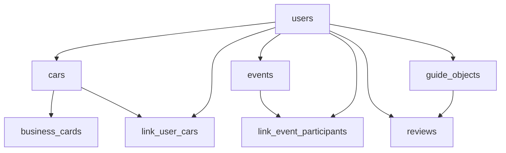
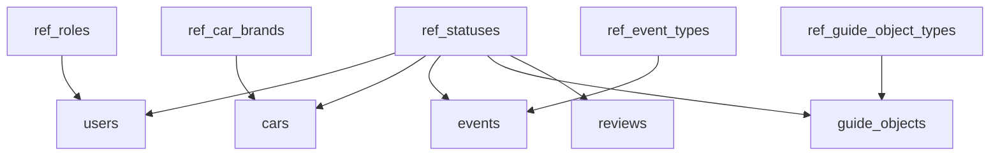

# 🗄️ База данных CabrioRide

> Полная схема и структура базы данных проекта

## 📋 Назначение

База данных CabrioRide обеспечивает хранение всех данных проекта: пользователи, автомобили, события, гид-объекты, отзывы, фотографии и системные журналы.

## 🏗️ Архитектура

### Типы таблиц
- **Справочники** — универсальные каталоги (роли, статусы, типы)
- **Основные сущности** — пользователи, автомобили, события
- **Связующие таблицы** — связи между сущностями
- **Системные журналы** — логирование действий
- **Файловое хранилище** — фотографии и медиа

### Принципы проектирования
- **Нормализация** — минимизация дублирования данных
- **Справочники** — централизованные каталоги
- **Аудит** — логирование всех важных действий
- **Масштабируемость** — поддержка роста данных

## 📊 Структура таблиц

### Справочники (Reference Tables)
- **[ref_roles](SCHEMA.md#ref_roles)** — роли пользователей
- **[ref_statuses](SCHEMA.md#ref_statuses)** — статусы сущностей
- **[ref_event_types](SCHEMA.md#ref_event_types)** — типы событий
- **[ref_guide_object_types](SCHEMA.md#ref_guide_object_types)** — типы гид-объектов
- **[ref_guide_object_kinds](SCHEMA.md#ref_guide_object_kinds)** — виды гид-объектов
- **[ref_car_brands](SCHEMA.md#ref_car_brands)** — марки автомобилей

### Основные сущности
- **[users](SCHEMA.md#users)** — пользователи платформы
- **[cars](SCHEMA.md#cars)** — автомобили участников
- **[events](SCHEMA.md#events)** — события/мероприятия
- **[guide_objects](SCHEMA.md#guide_objects)** — объекты гида
- **[reviews](SCHEMA.md#reviews)** — отзывы о гид-объектах
- **[business_cards](SCHEMA.md#business_cards)** — визитки/приглашения

### Связующие таблицы
- **[link_user_cars](SCHEMA.md#link_user_cars)** — связь пользователей и автомобилей
- **[link_event_participants](SCHEMA.md#link_event_participants)** — участники событий

### Системные таблицы
- **[photos](SCHEMA.md#photos)** — универсальное хранилище фотографий
- **[sessions](SCHEMA.md#sessions)** — сессии пользователей
- **[user_locations](SCHEMA.md#user_locations)** — геолокация пользователей
- **[map_hints](SCHEMA.md#map_hints)** — метки на карте
- **[moderation_logs](SCHEMA.md#moderation_logs)** — логи модерации
- **[activity_logs](SCHEMA.md#activity_logs)** — логи активности

## 🔗 Связи между таблицами

### Основные связи

### Справочные связи

## 📝 Ключевые особенности

### Универсальная система статусов
- Все сущности используют единую таблицу `ref_statuses`
- Статусы привязаны к типу сущности через `entity_type`
- Гибкая система переходов между статусами

### Роли пользователей
- **external** — внешний пользователь
- **guest** — гость (в чате)
- **user** — пользователь (завершил регистрацию)
- **member** — участник клуба
- **moderator** — модератор
- **admin** — администратор

### Статусы автомобилей
- **noticed** — замечен
- **business_card** — визитка
- **active** — активен
- **archived** — в архиве
- **blocked** — заблокирован
- **pending** — на модерации
- **deleted** — удалён

### Универсальная система фотографий
- Таблица `photos` используется для всех типов медиа
- Связь через `entity_type` и `entity_id`
- Поддержка различных типов фото (avatar, cover, gallery)

## 🔐 Безопасность

### Индексы
- Первичные ключи на всех таблицах
- Индексы на внешних ключах
- Составные индексы для сложных запросов
- Уникальные ограничения на критичные поля

### Аудит
- Логирование всех действий модераторов
- Отслеживание активности пользователей
- История изменений статусов
- Контроль лимитов и ограничений

## 📈 Производительность

### Оптимизация запросов
- Индексы на часто используемых полях
- Составные индексы для сложных фильтров
- Партиционирование по датам (планируется)
- Кэширование справочников

### Масштабирование
- Поддержка большого количества пользователей
- Эффективное хранение фотографий
- Оптимизация геопространственных запросов
- Горизонтальное масштабирование (планируется)

## 🛠️ Управление

### Миграции
- Версионирование схемы БД
- Автоматические миграции
- Откат изменений
- Резервное копирование

### Мониторинг
- Отслеживание производительности
- Мониторинг размера БД
- Анализ медленных запросов
- Контроль целостности данных

## 📚 Документация

### Детальная схема
- **[SCHEMA.md](SCHEMA.md)** — полное описание всех таблиц
- **[RELATIONS.md](RELATIONS.md)** — связи между таблицами
- **[STATUSES_AND_ROLES.md](STATUSES_AND_ROLES.md)** — статусы и роли

### Примеры запросов
- **[QUERIES.md](QUERIES.md)** — типовые SQL запросы
- **[MIGRATIONS.md](MIGRATIONS.md)** — миграции БД
- **[BACKUP.md](BACKUP.md)** — резервное копирование

---

**📚 См. также:** [Схема БД](SCHEMA.md), [Связи таблиц](RELATIONS.md), [Статусы и роли](STATUSES_AND_ROLES.md) 