# 🔗 Связи между таблицами CabrioRide

> Визуализация и описание всех связей между таблицами базы данных

## 📊 ER-диаграмма структуры базы данных

```mermaid
flowchart TD
  %% --- Справочники ---
  subgraph "Справочники"
    ref_roles[ref_roles]
    ref_statuses[ref_statuses]
    ref_event_types[ref_event_types]
    ref_guide_object_types[ref_guide_object_types]
    ref_guide_object_kinds[ref_guide_object_kinds]
    ref_car_brands[ref_car_brands]
  end

  %% --- Пользователи и фото ---
  subgraph "Пользователи и фото"
    users[users]
    photos[photos]
    user_locations[user_locations]
  end

  %% --- Основные сущности ---
  subgraph "Основные сущности"
    cars[cars]
    events[events]
    guide_objects[guide_objects]
    reviews[reviews]
    business_cards[business_cards]
  end

  %% --- Таблицы связей ---
  subgraph "Связи"
    link_user_cars[link_user_cars]
    link_event_participants[link_event_participants]
  end

  %% --- Системные журналы ---
  subgraph "Системные журналы"
    sessions[sessions]
    moderation_logs[moderation_logs]
    activity_logs[activity_logs]
    map_hints[map_hints]
  end

  %% --- FK связи справочников ---
  ref_roles --> users
  ref_statuses --> users
  ref_statuses --> cars
  ref_statuses --> events
  ref_statuses --> guide_objects
  ref_statuses --> reviews
  ref_event_types --> events
  ref_guide_object_types --> guide_objects
  ref_guide_object_kinds --> guide_objects
  ref_car_brands --> cars

  %% --- Основные связи ---
  users -->|FK| cars
  users -->|FK| events
  users -->|FK| business_cards
  users -->|FK| guide_objects
  users -->|FK| reviews
  cars -->|FK| business_cards
  guide_objects -->|FK| reviews
  events -->|FK| link_event_participants
  cars -->|FK| link_user_cars
  users -->|FK| link_user_cars
  users -->|FK| link_event_participants
  users -->|FK| user_locations
  users -->|FK| sessions
  users -->|FK| moderation_logs
  users -->|FK| activity_logs
  users -->|FK| map_hints

  %% --- Self-referencing связи пользователей ---
  users -->|host_user_id| users
  users -->|referrer_id| users

  %% --- Универсальная связь photos (пунктир) ---
  photos -.->|логическая| users
  photos -.->|логическая| cars
  photos -.->|логическая| events
  photos -.->|логическая| guide_objects
  photos -.->|логическая| reviews
  photos -.->|логическая| business_cards

  %% --- Визуальные стили ---
  classDef ref fill:#4B0082,color:#fff,stroke:#222,stroke-width:2px;
  classDef main fill:#006400,color:#fff,stroke:#222,stroke-width:2px;
  classDef link fill:#333,color:#fff,stroke:#222,stroke-width:2px;
  classDef photo fill:#FF8C00,color:#fff,stroke:#222,stroke-width:3px;
  classDef system fill:#8B0000,color:#fff,stroke:#222,stroke-width:2px;

  class ref_roles,ref_statuses,ref_event_types,ref_guide_object_types,ref_guide_object_kinds,ref_car_brands ref;
  class users main;
  class cars,events,guide_objects,reviews,business_cards main;
  class link_user_cars,link_event_participants link;
  class photos photo;
  class sessions,moderation_logs,activity_logs,map_hints,user_locations system;
```

## 🔗 Детальное описание связей

### Связи справочников

#### ref_roles → users
- **Тип:** Один ко многим (1:N)
- **Поле:** `users.role_id` → `ref_roles.id`
- **Описание:** Определяет роль пользователя в системе
- **Ограничения:** NOT NULL, FOREIGN KEY

#### ref_statuses → сущности
- **Тип:** Один ко многим (1:N)
- **Поля:** 
  - `users.status_id` → `ref_statuses.id`
  - `cars.status_id` → `ref_statuses.id`
  - `events.status_id` → `ref_statuses.id`
  - `guide_objects.status_id` → `ref_statuses.id`
  - `reviews.status_id` → `ref_statuses.id`
- **Описание:** Универсальная система статусов для всех сущностей
- **Фильтрация:** По `entity_type` в `ref_statuses`

#### ref_event_types → events
- **Тип:** Один ко многим (1:N)
- **Поле:** `events.event_type_id` → `ref_event_types.id`
- **Описание:** Тип события (поездка, встреча, и т.д.)

#### ref_guide_object_types → guide_objects
- **Тип:** Один ко многим (1:N)
- **Поле:** `guide_objects.guide_object_type_id` → `ref_guide_object_types.id`
- **Описание:** Тип гид-объекта (кафе, сервис, и т.д.)

#### ref_guide_object_kinds → guide_objects
- **Тип:** Один ко многим (1:N)
- **Поле:** `guide_objects.guide_object_kind_id` → `ref_guide_object_kinds.id`
- **Описание:** Вид гид-объекта (завтрак, обед, и т.д.)
- **Связь:** `ref_guide_object_kinds.type_id` → `ref_guide_object_types.id`

#### ref_car_brands → cars
- **Тип:** Один ко многим (1:N)
- **Поле:** `cars.car_brand_id` → `ref_car_brands.id`
- **Описание:** Марка автомобиля

### Основные связи

#### users → cars
- **Тип:** Один ко многим (1:N)
- **Поля:** 
  - `cars.create_user_id` → `users.id` (кто создал)
  - `cars.owner_user_id` → `users.id` (владелец)
- **Описание:** Связь пользователей с их автомобилями

#### users → events
- **Тип:** Один ко многим (1:N)
- **Поле:** `events.org_user_id` → `users.id`
- **Описание:** Организатор события

#### users → guide_objects
- **Тип:** Один ко многим (1:N)
- **Поле:** `guide_objects.add_user_id` → `users.id`
- **Описание:** Кто добавил гид-объект

#### users → reviews
- **Тип:** Один ко многим (1:N)
- **Поле:** `reviews.author_user_id` → `users.id`
- **Описание:** Автор отзыва

#### cars → business_cards
- **Тип:** Один ко многим (1:N)
- **Поле:** `business_cards.car_id` → `cars.id`
- **Описание:** Визитки для конкретного автомобиля

#### guide_objects → reviews
- **Тип:** Один ко многим (1:N)
- **Поле:** `reviews.guide_object_id` → `guide_objects.id`
- **Описание:** Отзывы о гид-объекте

### Связующие таблицы

#### link_user_cars
- **Тип:** Многие ко многим (M:N)
- **Связи:**
  - `link_user_cars.user_id` → `users.id`
  - `link_user_cars.car_id` → `cars.id`
  - `link_user_cars.role_id` → `ref_roles.id`
- **Описание:** Связь пользователей с автомобилями (владелец, пассажир)
- **Первичный ключ:** (user_id, car_id, role_id)

#### link_event_participants
- **Тип:** Многие ко многим (M:N)
- **Связи:**
  - `link_event_participants.event_id` → `events.id`
  - `link_event_participants.user_id` → `users.id`
- **Описание:** Участники событий
- **Первичный ключ:** (event_id, user_id)

### Системные связи

#### users → sessions
- **Тип:** Один ко многим (1:N)
- **Поле:** `sessions.user_id` → `users.id`
- **Описание:** Сессии пользователей для авторизации

#### users → user_locations
- **Тип:** Один к одному (1:1)
- **Поле:** `user_locations.user_id` → `users.id`
- **Описание:** Геолокация пользователей

#### users → moderation_logs
- **Тип:** Один ко многим (1:N)
- **Поля:**
  - `moderation_logs.user_id` → `users.id` (модерируемый)
  - `moderation_logs.moderator_id` → `users.id` (модератор)
- **Описание:** Логи модерации

#### users → activity_logs
- **Тип:** Один ко многим (1:N)
- **Поля:**
  - `activity_logs.from_user_id` → `users.id` (кто поставил)
  - `activity_logs.to_user_id` → `users.id` (кому поставили)
- **Описание:** Логи активности между пользователями

#### users → map_hints
- **Тип:** Один ко многим (1:N)
- **Поля:**
  - `map_hints.user_id` → `users.id` (кто поставил)
  - `map_hints.removed_by` → `users.id` (кто удалил)
- **Описание:** Метки на карте

### Self-referencing связи

#### users → users (host_user_id)
- **Тип:** Один ко многим (1:N)
- **Поле:** `users.host_user_id` → `users.id`
- **Описание:** Основной гость пользователя

#### users → users (referrer_id)
- **Тип:** Один ко многим (1:N)
- **Поле:** `users.referrer_id` → `users.id`
- **Описание:** Реферер пользователя

### Универсальная система фотографий

#### photos → все сущности
- **Тип:** Логическая связь (не FK)
- **Поля:** 
  - `photos.entity_type` (тип сущности)
  - `photos.entity_id` (ID сущности)
- **Поддерживаемые типы:**
  - `user` → `users.id`
  - `car` → `cars.id`
  - `event` → `events.id`
  - `guide_object` → `guide_objects.id`
  - `review` → `reviews.id`
  - `business_card` → `business_cards.id`

## 📊 Кардинальность связей

### Один к одному (1:1)
- `users` ↔ `user_locations`

### Один ко многим (1:N)
- `ref_roles` → `users`
- `ref_statuses` → все сущности
- `ref_event_types` → `events`
- `ref_guide_object_types` → `guide_objects`
- `ref_car_brands` → `cars`
- `users` → `cars` (create_user_id, owner_user_id)
- `users` → `events` (org_user_id)
- `users` → `guide_objects` (add_user_id)
- `users` → `reviews` (author_user_id)
- `cars` → `business_cards`
- `guide_objects` → `reviews`

### Многие ко многим (M:N)
- `users` ↔ `cars` (через `link_user_cars`)
- `users` ↔ `events` (через `link_event_participants`)

### Логические связи
- `photos` ↔ все сущности (через entity_type/entity_id)

## 🔐 Ограничения целостности

### Внешние ключи
- Все связи защищены FOREIGN KEY ограничениями
- Каскадное удаление настроено для критичных связей
- Ограничения на уровне приложения для сложных случаев

### Уникальные ограничения
- `users.telegram_id` — уникальный
- `users.email` — уникальный (если заполнен)
- `users.phone` — уникальный (если заполнен)
- `cars.vin` — уникальный (если заполнен)
- `cars.reg_number` — уникальный (если заполнен)
- `guide_objects.name + city` — уникальная пара
- `reviews.guide_object_id + author_user_id` — уникальная пара
- `activity_logs.from_user_id + to_user_id + date` — уникальная тройка

### Проверки
- Статусы соответствуют типу сущности
- Даты логичны (created_at ≤ updated_at)
- Координаты в допустимых пределах
- Рейтинги в допустимых диапазонах

## 📈 Оптимизация запросов

### Индексы
- Все внешние ключи проиндексированы
- Составные индексы для сложных запросов
- Индексы на часто используемых полях фильтрации
- Геопространственные индексы для координат

### Партиционирование
- `activity_logs` по дате (планируется)
- `moderation_logs` по дате (планируется)
- `photos` по entity_type (планируется)

---

**📚 См. также:** [Обзор БД](OVERVIEW.md), [Схема БД](SCHEMA.md), [Статусы и роли](STATUSES_AND_ROLES.md) 