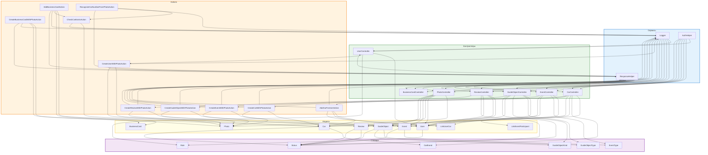

# 🗺️ Mermaid-диаграмма ключевых связей backend CabrioRide

```mermaid
flowchart TD

%% 1. Сервисы (Utils) — синий фон
subgraph Сервисы
  direction LR
  Logger
  ResponseHelper
  AuthHelper
end
style Сервисы fill:#e3f2fd,stroke:#1976d2,stroke-width:2px

%% 2. Контроллеры — зелёный фон
subgraph Контроллеры
  direction LR
  UserController
  CarController
  EventController
  GuideObjectController
  ReviewController
  PhotoController
  BusinessCardController
end
style Контроллеры fill:#e8f5e9,stroke:#388e3c,stroke-width:2px

%% 3. Модели — жёлтый фон
subgraph Модели
  direction TB
  User
  Car
  Event
  GuideObject
  Review
  Photo
  BusinessCard
  LinkUserCar
  LinkEventParticipant
end
style Модели fill:#fffde7,stroke:#fbc02d,stroke-width:2px

%% 4. Actions — оранжевый фон
subgraph Actions
  direction TB
  CreateUserWithPhotoAction
  AddCarForUserAction
  CreateCarWithPhotoAction
  AddBusinessCardAction
  CreateBusinessCardWithPhotoAction
  CheckCarExistsAction
  RecognizeCarNumberFromPhotoAction
  CreateEventWithPhotoAction
  CreateGuideObjectWithPhotoAction
  CreateReviewWithPhotoAction
end
style Actions fill:#fff3e0,stroke:#f57c00,stroke-width:2px

%% 5. Словари — фиолетовый фон
subgraph Словари
  direction LR
  CarBrand
  EventType
  GuideObjectType
  GuideObjectKind
  Status
  Role
end
style Словари fill:#f3e5f5,stroke:#7b1fa2,stroke-width:2px

%% Связи между уровнями
Logger --> UserController
Logger --> CarController
Logger --> EventController
Logger --> GuideObjectController
Logger --> ReviewController
Logger --> PhotoController
Logger --> BusinessCardController
ResponseHelper --> UserController
ResponseHelper --> CarController
ResponseHelper --> EventController
ResponseHelper --> GuideObjectController
ResponseHelper --> ReviewController
ResponseHelper --> PhotoController
ResponseHelper --> BusinessCardController
AuthHelper --> UserController
AuthHelper --> CarController
AuthHelper --> EventController
AuthHelper --> GuideObjectController
AuthHelper --> ReviewController
AuthHelper --> PhotoController
AuthHelper --> BusinessCardController

UserController --> User
UserController --> Role
UserController --> CreateUserWithPhotoAction
CarController --> Car
CarController --> CarBrand
CarController --> User
CarController --> LinkUserCar
CarController --> AddCarForUserAction
CarController --> CreateCarWithPhotoAction
EventController --> Event
EventController --> EventType
EventController --> User
EventController --> LinkEventParticipant
EventController --> CreateEventWithPhotoAction
GuideObjectController --> GuideObject
GuideObjectController --> GuideObjectType
GuideObjectController --> GuideObjectKind
GuideObjectController --> User
GuideObjectController --> Status
GuideObjectController --> CreateGuideObjectWithPhotoAction
ReviewController --> Review
ReviewController --> GuideObject
ReviewController --> User
ReviewController --> Status
ReviewController --> CreateReviewWithPhotoAction
PhotoController --> Photo
PhotoController --> User
PhotoController --> Car
PhotoController --> Event
PhotoController --> Review
PhotoController --> GuideObject

CreateUserWithPhotoAction --> User
CreateUserWithPhotoAction --> Photo
CreateUserWithPhotoAction --> Logger
CreateUserWithPhotoAction --> ResponseHelper
AddCarForUserAction --> Car
AddCarForUserAction --> User
AddCarForUserAction --> LinkUserCar
AddCarForUserAction --> Logger
AddCarForUserAction --> ResponseHelper
CreateCarWithPhotoAction --> Car
CreateCarWithPhotoAction --> Photo
CreateCarWithPhotoAction --> Logger
CreateCarWithPhotoAction --> ResponseHelper
AddBusinessCardAction --> BusinessCard
AddBusinessCardAction --> Car
AddBusinessCardAction --> CheckCarExistsAction
AddBusinessCardAction --> Logger
AddBusinessCardAction --> ResponseHelper
CreateBusinessCardWithPhotoAction --> BusinessCard
CreateBusinessCardWithPhotoAction --> Photo
CreateBusinessCardWithPhotoAction --> Logger
CreateBusinessCardWithPhotoAction --> ResponseHelper
CheckCarExistsAction --> Car
CheckCarExistsAction --> Logger
RecognizeCarNumberFromPhotoAction --> CheckCarExistsAction
RecognizeCarNumberFromPhotoAction --> Logger
RecognizeCarNumberFromPhotoAction --> ResponseHelper
CreateEventWithPhotoAction --> Event
CreateEventWithPhotoAction --> Photo
CreateEventWithPhotoAction --> Logger
CreateEventWithPhotoAction --> ResponseHelper
CreateGuideObjectWithPhotoAction --> GuideObject
CreateGuideObjectWithPhotoAction --> Photo
CreateGuideObjectWithPhotoAction --> Logger
CreateGuideObjectWithPhotoAction --> ResponseHelper
CreateReviewWithPhotoAction --> Review
CreateReviewWithPhotoAction --> Photo
CreateReviewWithPhotoAction --> Logger
CreateReviewWithPhotoAction --> ResponseHelper

%% Стрелки от моделей к словарям
Car --> CarBrand
Event --> EventType
GuideObject --> GuideObjectType
GuideObject --> GuideObjectKind
Review --> Status
User --> Role
GuideObject --> Status
Car --> Status
Event --> Status
Review --> Status
``` 