# Схема доступа по ролям и разделам CabrioRide

```mermaid
flowchart TB
    %% Группировка ролей
    subgraph roles [Роли]
        direction TB
        external["external"]
        guest["guest"]
        new["new"]
        registered["registered"]
        member["member"]
        moderator["moderator"]
        admin["admin"]
    end

    %% Группировка разделов
    subgraph sections [Разделы приложения]
        direction TB
        landing["landing"]
        auth["auth"]
        profile["profile"]
        dashboard["dashboard"]
        cars["cars"]
        events["events"]
        map["map"]
        businessCard["businessCard"]
        notifications["notifications"]
        moderation["moderation"]
        adminSection["admin"]
        support["support"]
    end

    %% Доступ к разделам (стрелки от всех ролей, которые имеют доступ)
    external --> landing
    guest --> landing
    new --> landing
    registered --> landing
    member --> landing
    moderator --> landing
    admin --> landing

    guest --> auth
    new --> auth
    registered --> auth
    member --> auth
    moderator --> auth
    admin --> auth

    guest --> support
    new --> support
    registered --> support
    member --> support
    moderator --> support
    admin --> support

    registered --> profile
    member --> profile
    moderator --> profile
    admin --> profile

    registered --> dashboard
    member --> dashboard
    moderator --> dashboard
    admin --> dashboard

    registered --> notifications
    member --> notifications
    moderator --> notifications
    admin --> notifications

    member --> cars
    moderator --> cars
    admin --> cars

    member --> events
    moderator --> events
    admin --> events

    member --> map
    moderator --> map
    admin --> map

    member --> businessCard
    moderator --> businessCard
    admin --> businessCard

    moderator --> moderation
    admin --> moderation

    admin --> adminSection

    %% Легенда
    legend["Стрелка = роль, имеющая доступ к разделу. Чем выше роль, тем больше прав."]
    legend -.-> landing
```

---

## Принцип работы схемы
- **Стрелка от роли к разделу — это минимальная роль для доступа.**
- Все роли выше по иерархии (см. массив ROLES в config/sectionGroups.ts) также имеют доступ к этому разделу.
- Например, если минимальная роль для раздела — member, то moderator и admin тоже имеют доступ.
- В коде это реализовано сравнением индексов в массиве ролей.

## Рекомендации
- Используйте эту схему для быстрой проверки и обсуждения прав доступа.
- Для актуальной логики всегда сверяйтесь с файлом config/sectionGroups.ts (он — источник правды для кода). 