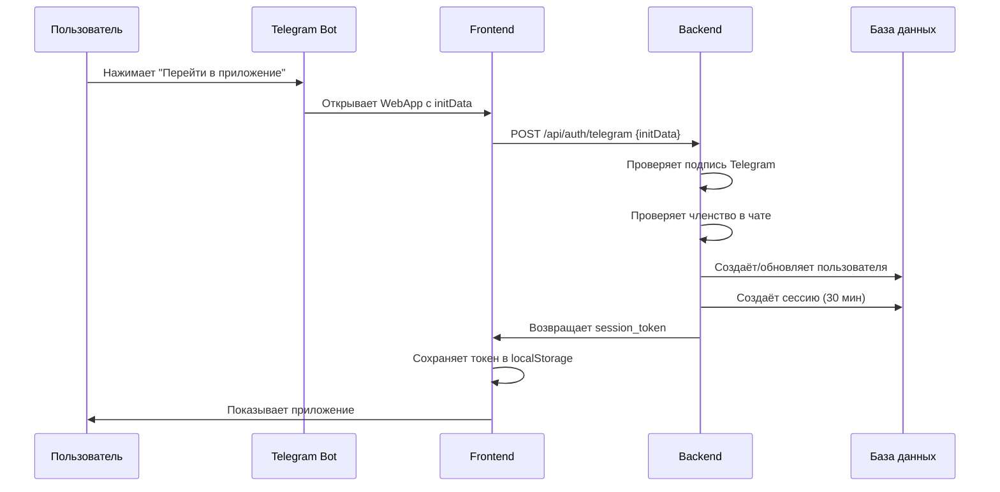
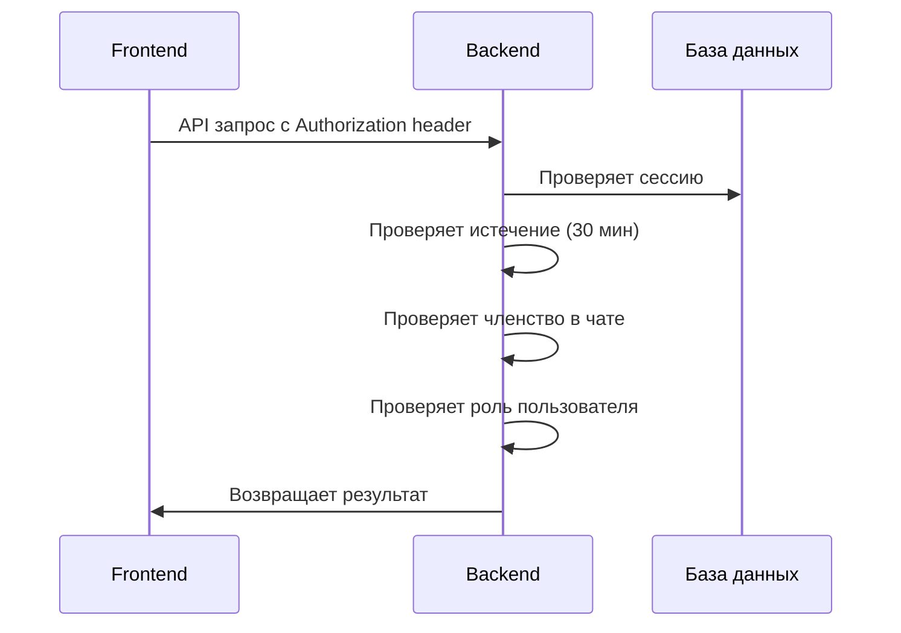
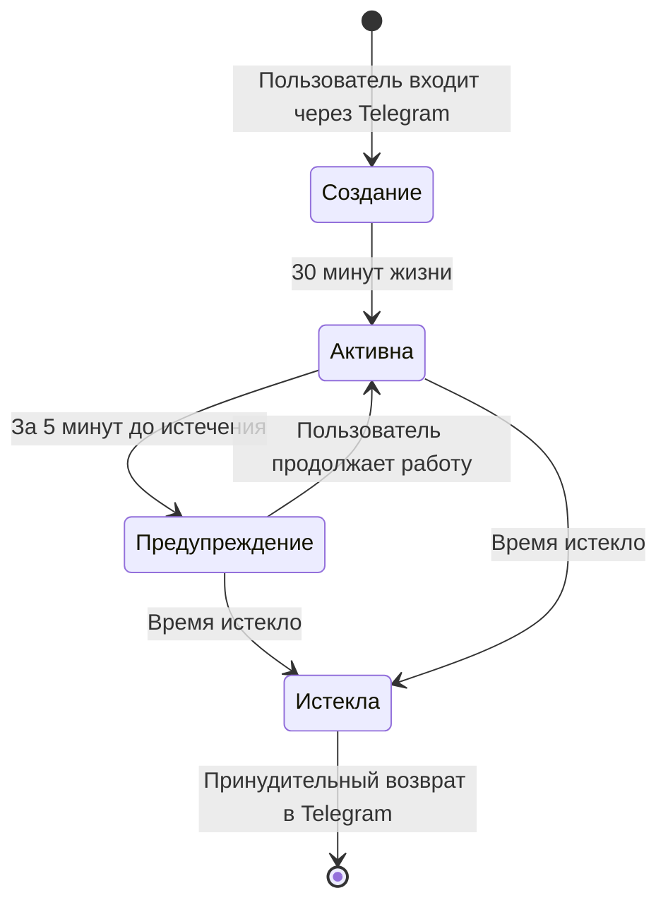

# 🔐 Архитектура авторизации CabrioRide

> 📋 **Документ создан:** 20 июля 2025  
> 📋 **Статус:** Актуальная версия для разработки  
> 📋 **Основан на:** docs/USER_ROLES.md, docs/USER_FLOWS/12_authorization.md, config/sectionGroups.ts  
> 📋 **Связанные документы:** API_METHODS.md, USER_ROLES.md, ACCESS_SCHEME.md

---

## 🎯 Обзор архитектуры

CabrioRide использует **авторизацию через Telegram WebApp** с **короткими сессиями (30 минут)**. Это обеспечивает высокую безопасность и простоту использования для участников клубного чата.

### Ключевые принципы:
- ✅ Авторизация только через Telegram WebApp
- ✅ Короткие сессии (30 минут)
- ✅ Принудительный возврат в Telegram при истечении
- ✅ Проверка членства в клубном чате
- ✅ Ролевая система доступа

---

## Кратко для разработчиков

- Вся логика авторизации, сессий, ролей и идентификации описана только в этом документе. В других местах — только ссылки сюда.
- Основной идентификатор пользователя — user_id (автоинкремент в БД), Telegram ID хранится отдельно (users.telegram_id).
- Авторизация только через Telegram WebApp. Регистрация и вход — только через Telegram.
- Проверка членства в клубном чате Telegram выполняется ТОЛЬКО при создании сессии (авторизации). Если пользователь не состоит в чате — токен не создаётся, возвращается ошибка.
- Если токен уже создан — считается, что членство в чате уже проверено. Повторная проверка при каждом запросе НЕ требуется (оптимизация).
- Все данные о роли пользователя подтягиваются из БД при создании/валидации сессии и хранятся в сессии. Фронтенд не хранит роль/user_id локально, только session_token.
- Telegram ID как основной user_id не используется — это не даёт архитектурных преимуществ при наличии сессий.
- Все защищённые endpoint-ы используют SessionMiddleware для проверки токена, роли и прав доступа.
- Жизненный цикл сессии: создание (при авторизации), валидация (при каждом запросе), истечение (через 30 минут), удаление (logout или cron).
- Все edge-cases (смена Telegram-аккаунта, выход из чата, бан) описаны ниже.

---

## 🔄 Процесс авторизации

### 1. Вход в приложение


### 2. Проверка доступа


---

## 🗄️ Структура базы данных

### Таблица sessions (НОВАЯ)
```sql
CREATE TABLE sessions (
    id BIGINT UNSIGNED AUTO_INCREMENT PRIMARY KEY,
    user_id BIGINT UNSIGNED NOT NULL,
    session_token VARCHAR(255) UNIQUE NOT NULL,
    telegram_data JSON,
    created_at TIMESTAMP DEFAULT CURRENT_TIMESTAMP,
    expires_at TIMESTAMP NOT NULL, -- 30 минут от создания
    is_active BOOLEAN DEFAULT TRUE,
    
    FOREIGN KEY (user_id) REFERENCES users(id),
    INDEX idx_session_token (session_token),
    INDEX idx_expires_at (expires_at),
    INDEX idx_user_id (user_id)
);
```

### Таблица users (ДОПОЛНЕНИЕ)
```sql
-- Добавляем недостающие поля для Telegram авторизации
ALTER TABLE users ADD COLUMN telegram_photo_url VARCHAR(255);
ALTER TABLE users ADD COLUMN last_telegram_auth TIMESTAMP;

-- Поля уже существуют:
-- telegram_id BIGINT (уже есть)
-- username VARCHAR(100) (уже есть) 
-- first_name_tg VARCHAR(100) (уже есть)
-- last_name_tg VARCHAR(100) (уже есть)
```

---

## 🔧 Backend реализация

### 1. Endpoint авторизации
```php
// api/auth/telegram.php
class TelegramAuthEndpoint {
    public function handle($request) {
        $initData = $request->getData();
        
        // 1. Проверяем подпись Telegram
        if (!$this->verifyTelegramSignature($initData)) {
            return $this->badRequest('Invalid Telegram signature');
        }
        
        // 2. Извлекаем данные пользователя
        $telegramData = $this->parseInitData($initData);
        
        // 3. Проверяем членство в чате
        if (!$this->checkChatMembership($telegramData['user_id'])) {
            return $this->forbidden('Not in club chat');
        }
        
        // 4. Получаем или создаём пользователя
        $user = $this->getOrCreateUser($telegramData);
        
        // 5. Создаём короткую сессию (30 минут)
        $session = $this->createShortSession($user->id, $telegramData);
        
        return $this->success([
            'session_token' => $session->token,
            'expires_at' => $session->expires_at,
            'user' => $this->formatUser($user),
            'session_timeout' => 30 // минут
        ]);
    }
    
    private function createShortSession($userId, $telegramData) {
        $token = bin2hex(random_bytes(32));
        $expiresAt = date('Y-m-d H:i:s', time() + (30 * 60)); // 30 минут
        
        $session = new Session([
            'user_id' => $userId,
            'session_token' => $token,
            'telegram_data' => json_encode($telegramData),
            'expires_at' => $expiresAt
        ]);
        
        $session->save();
        return $session;
    }
    
    private function getOrCreateUser($telegramData) {
        // Ищем пользователя по telegram_id
        $user = User::where('telegram_id', $telegramData['id'])->first();
        
        if (!$user) {
            // Создаём нового пользователя
            $user = new User([
                'telegram_id' => $telegramData['id'],
                'username' => $telegramData['username'] ?? null,
                'first_name_tg' => $telegramData['first_name'] ?? null,
                'last_name_tg' => $telegramData['last_name'] ?? null,
                'telegram_photo_url' => $telegramData['photo_url'] ?? null,
                'role_id' => 1, // external по умолчанию
                'last_telegram_auth' => now()
            ]);
            $user->save();
        } else {
            // Обновляем данные из Telegram
            $user->update([
                'username' => $telegramData['username'] ?? $user->username,
                'first_name_tg' => $telegramData['first_name'] ?? $user->first_name_tg,
                'last_name_tg' => $telegramData['last_name'] ?? $user->last_name_tg,
                'telegram_photo_url' => $telegramData['photo_url'] ?? $user->telegram_photo_url,
                'last_telegram_auth' => now()
            ]);
        }
        
        return $user;
    }
}
```

### 2. Middleware для проверки сессии
```php
// middleware/SessionMiddleware.php
class SessionMiddleware {
    private $sessionTimeout = 30; // минут
    
    public function handle($request) {
        $token = $request->getHeader('Authorization');
        
        if (!$token) {
            return $this->unauthorized('No session token');
        }
        
        // Получаем сессию
        $session = $this->getSession($token);
        if (!$session || !$session->is_active) {
            return $this->unauthorized('Invalid session');
        }
        
        // Проверяем истечение (строго по expires_at)
        if (time() > strtotime($session->expires_at)) {
            $this->invalidateSession($session);
            return $this->unauthorized('Session expired - please return to Telegram');
        }
        
        // Получаем пользователя
        $user = $this->getUser($session->user_id);
        
        // Проверяем членство в чате
        if (!$this->checkChatMembership($user->telegram_id)) {
            $this->updateUserRole($user->id, 'external');
            return $this->forbidden('Not in chat - please return to Telegram');
        }
        
        // Сохраняем в контекст
        $request->setUser($user);
        $request->setSession($session);
    }
}
```

#### ВАЖНО:
- Проверка членства в чате Telegram выполняется только при создании сессии (авторизации). Если пользователь не состоит в чате — session_token не создаётся, возвращается ошибка.
- При каждом последующем запросе backend валидирует только токен и срок действия сессии. Повторная проверка членства в чате не требуется (оптимизация).
- Если пользователь покидает чат во время активной сессии — при следующей авторизации ему будет отказано в доступе.
- Все данные о роли пользователя подтягиваются из БД при создании/валидации сессии и хранятся в сессии.
- Фронтенд хранит только session_token, все остальные данные (роль, user_id, telegram_id) получает с backend при инициализации приложения или через /auth/check.

---

## 🔧 Backend реализация

### 1. Endpoint авторизации
```php
// api/auth/telegram.php
class TelegramAuthEndpoint {
    public function handle($request) {
        $initData = $request->getData();
        
        // 1. Проверяем подпись Telegram
        if (!$this->verifyTelegramSignature($initData)) {
            return $this->badRequest('Invalid Telegram signature');
        }
        
        // 2. Извлекаем данные пользователя
        $telegramData = $this->parseInitData($initData);
        
        // 3. Проверяем членство в чате
        if (!$this->checkChatMembership($telegramData['user_id'])) {
            return $this->forbidden('Not in club chat');
        }
        
        // 4. Получаем или создаём пользователя
        $user = $this->getOrCreateUser($telegramData);
        
        // 5. Создаём короткую сессию (30 минут)
        $session = $this->createShortSession($user->id, $telegramData);
        
        return $this->success([
            'session_token' => $session->token,
            'expires_at' => $session->expires_at,
            'user' => $this->formatUser($user),
            'session_timeout' => 30 // минут
        ]);
    }
    
    private function createShortSession($userId, $telegramData) {
        $token = bin2hex(random_bytes(32));
        $expiresAt = date('Y-m-d H:i:s', time() + (30 * 60)); // 30 минут
        
        $session = new Session([
            'user_id' => $userId,
            'session_token' => $token,
            'telegram_data' => json_encode($telegramData),
            'expires_at' => $expiresAt
        ]);
        
        $session->save();
        return $session;
    }
    
    private function getOrCreateUser($telegramData) {
        // Ищем пользователя по telegram_id
        $user = User::where('telegram_id', $telegramData['id'])->first();
        
        if (!$user) {
            // Создаём нового пользователя
            $user = new User([
                'telegram_id' => $telegramData['id'],
                'username' => $telegramData['username'] ?? null,
                'first_name_tg' => $telegramData['first_name'] ?? null,
                'last_name_tg' => $telegramData['last_name'] ?? null,
                'telegram_photo_url' => $telegramData['photo_url'] ?? null,
                'role_id' => 1, // external по умолчанию
                'last_telegram_auth' => now()
            ]);
            $user->save();
        } else {
            // Обновляем данные из Telegram
            $user->update([
                'username' => $telegramData['username'] ?? $user->username,
                'first_name_tg' => $telegramData['first_name'] ?? $user->first_name_tg,
                'last_name_tg' => $telegramData['last_name'] ?? $user->last_name_tg,
                'telegram_photo_url' => $telegramData['photo_url'] ?? $user->telegram_photo_url,
                'last_telegram_auth' => now()
            ]);
        }
        
        return $user;
    }
}
```

### 2. Middleware для проверки сессии
```php
// middleware/SessionMiddleware.php
class SessionMiddleware {
    private $sessionTimeout = 30; // минут
    
    public function handle($request) {
        $token = $request->getHeader('Authorization');
        
        if (!$token) {
            return $this->unauthorized('No session token');
        }
        
        // Получаем сессию
        $session = $this->getSession($token);
        if (!$session || !$session->is_active) {
            return $this->unauthorized('Invalid session');
        }
        
        // Проверяем истечение (строго по expires_at)
        if (time() > strtotime($session->expires_at)) {
            $this->invalidateSession($session);
            return $this->unauthorized('Session expired - please return to Telegram');
        }
        
        // Получаем пользователя
        $user = $this->getUser($session->user_id);
        
        // Проверяем членство в чате
        if (!$this->checkChatMembership($user->telegram_id)) {
            $this->updateUserRole($user->id, 'external');
            return $this->forbidden('Not in chat - please return to Telegram');
        }
        
        // Сохраняем в контекст
        $request->setUser($user);
        $request->setSession($session);
    }
}
```

### 3. Проверка ролей
```php
// utils/AccessControl.php
class AccessControl {
    private static $roles = [
        'external' => 0,
        'guest' => 1,
        'user' => 2,
        'user' => 3,
        'member' => 4,
        'moderator' => 5,
        'admin' => 6
    ];
    
    public static function hasRole($userRole, $requiredRole) {
        $userLevel = self::$roles[$userRole] ?? -1;
        $requiredLevel = self::$roles[$requiredRole] ?? 999;
        
        return $userLevel >= $requiredLevel;
    }
    
    public static function checkAccess($user, $function) {
        $requiredRole = FUNCTION_ROLES[$function] ?? 'admin';
        return self::hasRole($user->role, $requiredRole);
    }
}
```

---

## 🎨 Frontend реализация

### 1. Composable для авторизации
```typescript
// composables/useAuth.ts
export const useAuth = () => {
  const session = ref<Session | null>(null)
  const user = ref<User | null>(null)
  const sessionExpiresAt = ref<Date | null>(null)
  
  const login = async () => {
    try {
      const initData = Telegram.WebApp.initData
      const response = await api.post('/auth/telegram', { initData })
      
      session.value = response.data.session_token
      user.value = response.data.user
      sessionExpiresAt.value = new Date(response.data.expires_at)
      
      localStorage.setItem('session_token', session.value)
      localStorage.setItem('session_expires_at', response.data.expires_at)
      
      // Запускаем таймер уведомлений
      startSessionTimer()
      
    } catch (error) {
      console.error('Login failed:', error)
      handleLoginError(error)
    }
  }
  
  const startSessionTimer = () => {
    if (!sessionExpiresAt.value) return
    
    // Уведомление за 5 минут до истечения
    const warningTime = sessionExpiresAt.value.getTime() - (5 * 60 * 1000)
    const now = Date.now()
    
    if (warningTime > now) {
      setTimeout(() => {
        showSessionWarning()
      }, warningTime - now)
    }
    
    // Принудительный выход при истечении
    setTimeout(() => {
      handleSessionExpired()
    }, sessionExpiresAt.value.getTime() - now)
  }
  
  const showSessionWarning = () => {
    const modal = useModal()
    modal.show({
      title: 'Сессия скоро истечёт',
      message: 'Через 5 минут вам нужно будет снова войти через Telegram',
      actions: [
        { text: 'Продолжить', action: () => modal.hide() },
        { text: 'Войти заново', action: () => returnToTelegram() }
      ]
    })
  }
  
  const handleSessionExpired = () => {
    logout()
    
    const modal = useModal()
    modal.show({
      title: 'Сессия истекла',
      message: 'Время сессии истекло. Пожалуйста, вернитесь в Telegram для повторного входа.',
      actions: [
        { text: 'Вернуться в Telegram', action: () => returnToTelegram() }
      ],
      closable: false
    })
  }
  
  const returnToTelegram = () => {
    Telegram.WebApp.close()
  }
  
  return { 
    session, 
    user, 
    login, 
    showSessionWarning, 
    handleSessionExpired, 
    returnToTelegram 
  }
}
```

### 2. Axios interceptor
```typescript
// plugins/axios.ts
axios.interceptors.request.use(config => {
  const token = localStorage.getItem('session_token')
  if (token) {
    config.headers.Authorization = token
  }
  return config
})

axios.interceptors.response.use(
  response => response,
  error => {
    if (error.response?.status === 401) {
      const errorMessage = error.response.data?.message || ''
      
      if (errorMessage.includes('Session expired')) {
        const auth = useAuth()
        auth.handleSessionExpired()
      } else {
        const auth = useAuth()
        auth.logout()
        router.push('/login')
      }
    }
    return Promise.reject(error)
  }
)
```

### 3. Компонент таймера сессии
```vue
<!-- components/SessionTimer.vue -->
<template>
  <div v-if="showTimer" class="session-timer">
    <div class="timer-warning">
      <Icon name="clock" />
      <span>Сессия истечёт через {{ timeLeft }}</span>
      <button @click="extendSession">Продлить</button>
    </div>
  </div>
</template>

<script setup>
const { sessionExpiresAt } = useAuth()
const timeLeft = ref('')
const showTimer = ref(false)

const updateTimer = () => {
  if (!sessionExpiresAt.value) return
  
  const now = Date.now()
  const expires = sessionExpiresAt.value.getTime()
  const diff = expires - now
  
  if (diff <= 0) {
    const auth = useAuth()
    auth.handleSessionExpired()
    return
  }
  
  if (diff <= 5 * 60 * 1000) { // 5 минут
    showTimer.value = true
    const minutes = Math.floor(diff / 60000)
    const seconds = Math.floor((diff % 60000) / 1000)
    timeLeft.value = `${minutes}:${seconds.toString().padStart(2, '0')}`
  }
}

const extendSession = async () => {
  Telegram.WebApp.showAlert('Для продления сессии вернитесь в Telegram')
  Telegram.WebApp.close()
}

onMounted(() => {
  setInterval(updateTimer, 1000)
})
</script>
```

---

## 🛡️ Безопасность

### 1. Проверка подписи Telegram
```php
private function verifyTelegramSignature($initData) {
    $botToken = getConfig('bot_token');
    $secretKey = hash_hmac('sha256', $botToken, 'WebAppData', true);
    
    $dataCheckString = $initData;
    $signature = hash_hmac('sha256', $dataCheckString, $secretKey);
    
    return $signature === $initData['hash'];
}
```

### 2. Проверка членства в чате
```php
private function checkChatMembership($userId) {
    $chatId = getConfig('club_chat_id');
    $botToken = getConfig('bot_token');
    
    $url = "https://api.telegram.org/bot{$botToken}/getChatMember";
    $data = [
        'chat_id' => $chatId,
        'user_id' => $userId
    ];
    
    $response = file_get_contents($url, false, stream_context_create([
        'http' => [
            'method' => 'POST',
            'header' => 'Content-Type: application/json',
            'content' => json_encode($data)
        ]
    ]));
    
    $result = json_decode($response, true);
    return $result['ok'] && in_array($result['result']['status'], ['member', 'administrator', 'creator']);
}
```

### 3. Очистка старых сессий
```php
// Cron job для очистки
class SessionCleanup {
    public function cleanup() {
        $expiredSessions = Session::where('expires_at', '<', now())
            ->orWhere('is_active', false)
            ->get();
            
        foreach ($expiredSessions as $session) {
            $session->delete();
        }
    }
}
```

---

## 📋 API Endpoints

### Авторизация
| Метод | Endpoint | Описание |
|-------|----------|----------|
| POST | `/api/auth/telegram` | Авторизация через Telegram |
| GET | `/api/auth/check` | Проверка текущей сессии |
| POST | `/api/auth/logout` | Выход из системы |

### Формат ответа
```json
// Успешная авторизация
{
    "success": true,
    "data": {
        "session_token": "abc123...",
        "expires_at": "2025-07-20T10:30:00Z",
        "user": {
            "id": 1,
            "role": "member",
            "telegram_id": 123456789,
            "username": "user123"
        },
        "session_timeout": 30
    }
}

// Ошибка авторизации
{
    "success": false,
    "error": "Not in club chat",
    "code": 403
}
```

---

## ⏰ Временные параметры

| Параметр | Значение | Описание |
|----------|----------|----------|
| **Время жизни сессии** | 30 минут | Строгое ограничение |
| **Предупреждение** | За 5 минут | Уведомление пользователя |
| **Проверка активности** | При каждом запросе | Обновление last_activity |
| **Очистка сессий** | Каждый час | Cron job |

---

## 🔄 Жизненный цикл сессии



---

## 🚨 Обработка ошибок

### Типы ошибок авторизации:
1. **Invalid Telegram signature** - Неверная подпись Telegram
2. **Not in club chat** - Пользователь не в клубном чате
3. **Session expired** - Сессия истекла
4. **Invalid session** - Неверный токен сессии

### Действия при ошибках:
- **401 Unauthorized** - Перенаправление на вход через Telegram
- **403 Forbidden** - Показ заглушки с предложением вступить в чат
- **Session expired** - Принудительное закрытие WebApp

---

## 🧪 Тестирование

### Тест-кейсы:
1. **Успешная авторизация** - Пользователь в чате, валидные данные Telegram
2. **Не в чате** - Пользователь не состоит в клубном чате
3. **Истечение сессии** - Сессия истекла через 30 минут
4. **Предупреждение** - Уведомление за 5 минут до истечения
5. **Неверная подпись** - Поддельные данные Telegram

### Инструменты тестирования:
- `_test/test_telegram_auth.php` - Тест авторизации
- `_test/test_session_expiry.php` - Тест истечения сессии
- `_test/test_chat_membership.php` - Тест членства в чате

---

## 📝 Примечания для разработки

### Важные моменты:
1. Всегда проверяйте подпись Telegram — критично для безопасности.
2. Проверка членства в чате Telegram выполняется только при создании сессии (авторизации). Не делайте повторных проверок при каждом запросе.
3. Не продлевайте сессии автоматически — только через Telegram.
4. Логируйте все попытки авторизации — для аудита.
5. Очищайте старые сессии — для экономии ресурсов.
6. Все защищённые endpoint-ы должны использовать SessionMiddleware для проверки токена, роли и прав доступа.
7. Фронтенд не хранит роль/user_id локально, только session_token.
8. Telegram ID как основной user_id не используется — это не даёт архитектурных преимуществ при наличии сессий.

---

> 📋 **Последнее обновление:** 20 июля 2025  
> 📋 **Следующая ревизия:** При изменении архитектуры авторизации 