> См. также: [API](API_METHODS.md), [Роли пользователя](USER_ROLES.md), [Структура проекта](PROJECT_STRUCTURE.md)

# Связи между таблицами CabrioRide 🔗

> ⚠️ Внимание! С июля 2025 года используется новая структура базы данных. Актуальная схема, таблицы и связи — только в docs/DATABASE_SCHEMA.md. Ниже приведена визуализация (ER-диаграмма) актуальной структуры.

## ER-диаграмма структуры базы данных

```mermaid
flowchart TD
  %% --- Справочники ---
  subgraph "Справочники"
    ref_roles[ref_roles]
    ref_statuses[ref_statuses]
    ref_event_types[ref_event_types]
    ref_guide_object_types[ref_guide_object_types]
    ref_car_models[ref_car_models]
  end

  %% --- Пользователи и фото ---
  subgraph "Пользователи и фото"
    users[users]
    photos[photos]
  end

  %% --- Основные сущности ---
  subgraph "Основные сущности"
    cars[cars]
    events[events]
    guide_objects[guide_objects]
    reviews[reviews]
    business_cards[business_cards]
    user_locations[user_locations]
  end

  %% --- Таблицы связей ---
  subgraph "Связи"
    link_user_cars[link_user_cars]
    link_event_participants[link_event_participants]
  end

  %% --- Системные журналы ---
  subgraph "Системные журналы"
    respect_logs[respect_logs]
    moderation_logs[moderation_logs]
    map_hints[map_hints]
  end

  %% --- FK связи ---
  ref_roles --> users
  ref_statuses --> users
  ref_statuses --> cars
  ref_statuses --> events
  ref_statuses --> guide_objects
  ref_statuses --> reviews
  ref_event_types --> events
  ref_guide_object_types --> guide_objects
  ref_car_models --> cars

  users -->|FK| cars
  users -->|FK| events
  users -->|FK| business_cards
  users -->|FK| guide_objects
  users -->|FK| reviews
  cars -->|FK| business_cards
  guide_objects -->|FK| reviews
  events -->|FK| link_event_participants
  cars -->|FK| link_user_cars
  users -->|FK| link_user_cars
  users -->|FK| link_event_participants
  users -->|FK| user_locations
  respect_logs -->|from_user_id| users
  respect_logs -->|to_user_id| users
  moderation_logs -->|user_id| users
  moderation_logs -->|moderator_id| users
  map_hints -->|user_id| users
  map_hints -->|removed_by| users

  %% --- Self-referencing связи пользователей ---
  users -->|host_user_id| users
  users -->|referrer_id| users

  %% --- Универсальная связь photos (пунктир) ---
  photos -.->|логическая| users
  photos -.->|логическая| cars
  photos -.->|логическая| events
  photos -.->|логическая| guide_objects
  photos -.->|логическая| reviews
  photos -.->|логическая| business_cards

  %% --- Визуальные стили ---
  classDef ref fill:#4B0082,color:#fff,stroke:#222,stroke-width:2px;
  classDef main fill:#006400,color:#fff,stroke:#222,stroke-width:2px;
  classDef link fill:#333,color:#fff,stroke:#222,stroke-width:2px;
  classDef photo fill:#FF8C00,color:#fff,stroke:#222,stroke-width:3px;

  class ref_roles,ref_statuses,ref_event_types,ref_guide_object_types,ref_car_models ref;
  class users main;
  class cars,events,guide_objects,reviews,business_cards main;
  class link_user_cars,link_event_participants link;
  class photos photo;
```

---

## moderation_logs

- **user_id** — внешний ключ на users(id), указывает на пользователя, чей профиль модерируется.
- **moderator_id** — внешний ключ на users(id), указывает на модератора, выполнившего действие.
- Таблица moderation_logs позволяет отслеживать всю историю модерации профилей пользователей. 

## respect_logs

- **from_user_id** — внешний ключ на users(id), указывает на пользователя, который поставил respect.
- **to_user_id** — внешний ключ на users(id), указывает на пользователя, которому поставлен respect.
- Таблица respect_logs позволяет отслеживать историю выдачи respect, а также контролировать лимиты (1 раз в сутки одному человеку, максимум N респектов в день). 

## Связи с каталогами (catalogs)

- **cars.brand_id** → **car_brands.id**
- **events.type_id** → **event_types.id**
- **guide_objects.kind_id** → **guide_object_kinds.id**
- **guide_objects.type_id** → **guide_object_types.id**
- **users.role_id** → **roles.id**
- **cars.status_id**, **events.status_id**, **guide_objects.status_id** → **statuses.id**

> Все основные сущности ссылаются на соответствующие каталоги для обеспечения целостности и стандартизации данных. 