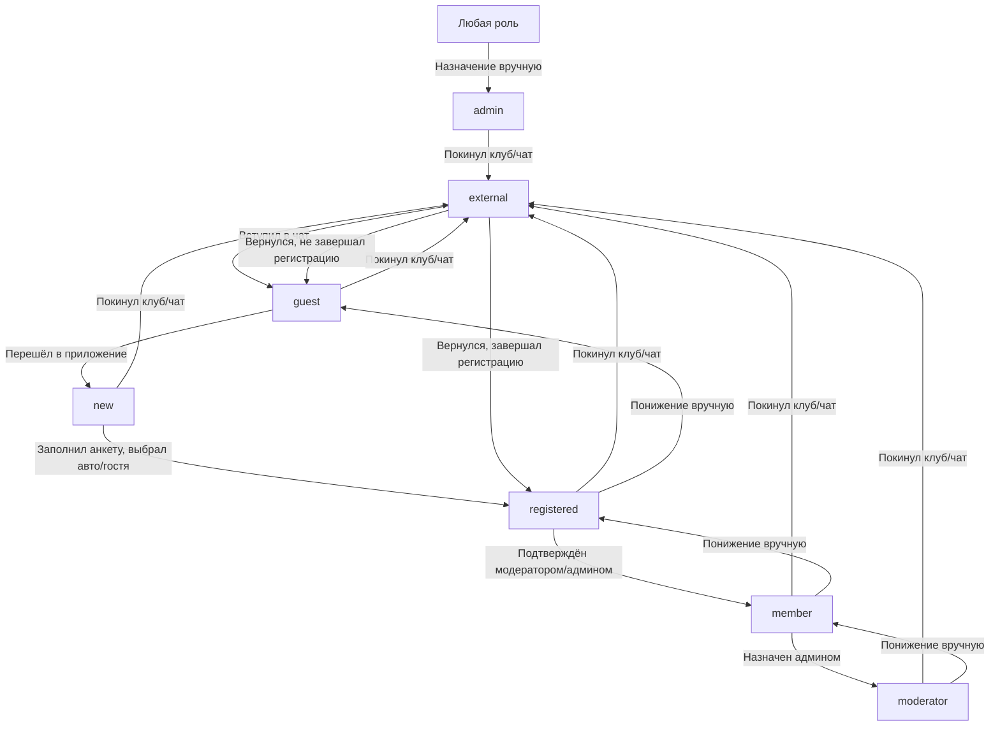

# Роли пользователя CabrioRide (финальная лаконичная структура)

> Этот документ описывает **роли пользователя** согласно новой логике. Для статусов и флагов других сущностей (профиль, авто, событие и т.д.) — см. отдельные документы.

---

## 📋 Список ролей пользователя

| Код        | Название         | Описание                                      |
|------------|------------------|-----------------------------------------------|
| external   | Внешний          | Не член клуба, не состоит в чате. Может видеть только приглашение/заглушку. |
| guest      | Гость            | Состоит в чате, не начал регистрацию, запись создаётся когда бот увидел, что участник добавился в чат или когда участник обратился к боту. |
| new        | Новый            | Начал регистрацию (перешёл в приложение), но не выбрал авто/главного гостя. Видит только форму регистрации. |
| registered | Зарегистрирован  | Завершил базовую регистрацию (выбрал авто или “я без авто” и главного гостя), но не подтверждён модератором.  |
| member     | Участник         | Подтверждён модератором, имеет доступ к основному функционалу. |
| moderator  | Модератор        | Может подтверждать участников, модерировать профили, управлять подсказками и событиями. |
| admin      | Администратор    | Полный доступ к управлению клубом, настройкам, пользователями и контентом. |

---

## 🔄 Сценарии переходов ролей

| Откуда      | Куда         | Условие/действие                                                                 |
|-------------|--------------|----------------------------------------------------------------------------------|
| external    | guest        | Вступил в клубный чат                                                             |
| guest       | new          | Впервые перешёл в приложение через Telegram-бота                                  |
| new         | registered   | Заполнил анкету, выбрал авто или “я без авто” и главного гостя                    |
| registered  | member       | Подтверждён модератором после личной встречи                                      |
| Любая роль  | external     | Покинул клуб/чат (или был удалён)                                                 |
| external    | guest        | Вернулся в клуб, не завершал регистрацию                                          |
| external    | registered   | Вернулся в клуб, ранее завершал регистрацию (выбран авто/гость, но не был member) |
| Любая роль  | moderator    | Только администратор может назначить модератора (через большую карточку участника) |
| registered  | member       | Модератор или администратор подтверждает после личной встречи                      |
| member      | moderator    | Только администратор может повысить до модератора                                 |
| Любая роль  | admin        | Только разработчик вручную через БД                                               |

---

## 🟣 Примеры жизненных ситуаций

- **external** — пользователь вышел из чата или был удалён.
- **guest** — только что добавился в чат, ещё не начинал регистрацию.
- **new** — впервые открыл приложение, но не выбрал авто/главного гостя.
- **registered** — выбрал авто или “я без авто” и главного гостя, но ещё не подтверждён.
- **member** — прошёл модерацию, посещал встречу, получил полный доступ.
- **moderator** — назначается только администратором через большую карточку участника.
- **admin** — назначается только вручную через БД разработчиком.

---

## 🛡️ Кто и как меняет роли

- **registered → member** — может сделать модератор или администратор (через большую карточку участника).
- **member → moderator** — только администратор (через большую карточку участника).
- **Любая роль → admin** — только разработчик вручную через БД.
- **Пользователь любой роли → external** — автоматически при выходе из чата.
- **Понижение ролей** — возможно только вручную администратором и только до registered. Ниже (до new, guest, external) вручную понизить нельзя. Автоматического понижения не происходит.
- **Удаление всех авто не приводит к автоматическому понижению роли ни для одной роли (member, moderator, admin).** Понижение возможно только вручную администратором (и только до registered для moderator, admin — только вручную через БД). Автоматического понижения не происходит.

---

## 🗺️ Схема переходов ролей (Mermaid)



---

## 💻 Пример кода для проверки роли пользователя (TypeScript)

```ts
// Проверка, что пользователь — полноценный участник (member) или выше
const isMemberOrHigher = (role: string) => {
  return ["member", "moderator", "admin"].includes(role);
};

// Пример использования:
if (isMemberOrHigher(user.role)) {
  // Доступ к основному функционалу
}
```

---

## 🔗 Связанные сценарии и документы

- [Регистрация и первый вход](USER_FLOWS/01_registration.md)
- [Редактирование профиля](USER_FLOWS/02_profile_edit.md)
- [Модерация профиля](USER_FLOWS/14_admin_tools.md)
- [Работа с Telegram-ботом](USER_FLOWS/11_telegram_bot.md)
- [Авторизация и вход через Telegram](USER_FLOWS/12_authorization.md)
- [Управление автомобилями](USER_FLOWS/03_car_management.md)
- [Сценарии пользователя (оглавление)](USER_FLOWS.md)
- [Схема БД: users, cars, link_user_cars](../DATABASE_SCHEMA.md)
- [API: /api/auth/telegram, /api/users, /api/cars](../API_METHODS.md)

---

## ❓ FAQ

- **Что если пользователь удалил авто?**  
  — Если был member — остаётся member. Если не был member — остаётся registered, пока не выберет новый авто или главного гостя.
- **Что если пользователь был member и удалил все авто?**  
  — Он остаётся member. Автоматического понижения роли не происходит. Понизить роль может только администратор вручную (и только до registered).
- **Что если пользователь не был member и удалил авто?**  
  — Остаётся registered, пока не выберет новый авто или главного гостя.
- **Что если последний авто пользователя удалил модератор или админ?**  
  — Роль пользователя не меняется автоматически. Он остаётся в своей текущей роли (например, member). Понизить роль может только администратор вручную (и только до registered).
- **Что если пользователь с ролью moderator или admin удалил у себя последний авто?**  
  — Роль пользователя не меняется автоматически. Он остаётся moderator (или admin). Понизить роль может только администратор вручную (и только до registered для moderator, admin — только вручную через БД).
- **Можно ли перескочить этапы?**  
  — Нет, только последовательные переходы.
- **Кто может назначить модератора?**  
  — Только администратор, через большую карточку участника.
- **Кто может перевести registered в member?**  
  — Модератор или администратор, после личной встречи.
- **Кто может перевести member в moderator?**  
  — Только администратор.
- **Кто может назначить admin?**  
  — Только разработчик вручную через БД.
- **Что если пользователь был registered, но его не подтвердили?**  
  — Остаётся registered, пока не будет подтверждён или не изменит данные.
- **Можно ли понизить роль (например, member → registered)?**  
  — Только вручную администратором и только до registered. Ниже вручную понизить нельзя. Автоматического понижения не предусмотрено.

---

## 🟢 Рекомендации

- Роль пользователя — основной критерий доступа к функциям.
- Все проверки доступа должны опираться на роль пользователя и, при необходимости, на дополнительные условия (например, "только автор или модератор").
- При добавлении новых ролей обязательно обновлять этот файл и согласовывать с командой.

---

> Если требуется — могу добавить примеры кода для проверки ролей или схемы для frontend/backend. 