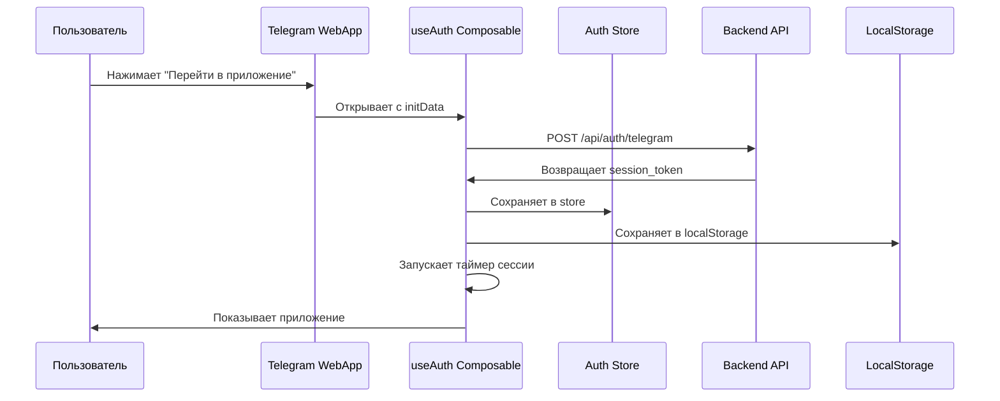

# 🔐 Система авторизации CabrioRide - Frontend

> Вся логика авторизации, сессий, ролей и идентификации описана в [docs/AUTH_ARCHITECTURE.md](../../docs/AUTH_ARCHITECTURE.md). Здесь приведены только frontend-специфика и интеграция.

---

## 🎯 Обзор системы авторизации

CabrioRide использует **авторизацию через Telegram WebApp** с **короткими сессиями (30 минут)**. Фронтенд отвечает за управление сессиями, отображение состояния авторизации и обработку истечения сессий.

### Ключевые принципы:
- ✅ Авторизация только через Telegram WebApp
- ✅ Короткие сессии (30 минут)
- ✅ Принудительный возврат в Telegram при истечении
- ✅ Автоматические уведомления о скором истечении
- ✅ Безопасное хранение токенов

---

## 🏗️ Архитектура фронтенда

### 1. Структура файлов
```
frontend/
├── composables/
│   └── useAuth.ts          # Основной composable авторизации
├── components/
│   ├── SessionTimer.vue     # Таймер сессии
│   ├── AuthModal.vue        # Модальные окна авторизации
│   └── SessionWarning.vue   # Предупреждения о сессии
├── stores/
│   └── auth.ts             # Pinia store для авторизации
├── plugins/
│   └── axios.ts            # Axios interceptor
└── types/
    └── auth.ts             # TypeScript типы
```

### 2. Поток данных


---

## 🎨 Composable useAuth

### Основной composable для авторизации

```typescript
// composables/useAuth.ts
export interface Session {
  token: string
  expiresAt: Date
  user: User
}

export interface User {
  id: number
  role: string
  telegram_id: number
  username?: string
  first_name_tg?: string
  last_name_tg?: string
  telegram_photo_url?: string
}

export const useAuth = () => {
  const session = ref<Session | null>(null)
  const user = ref<User | null>(null)
  const sessionExpiresAt = ref<Date | null>(null)
  const isAuthenticated = computed(() => !!session.value)
  const timeLeft = ref<string>('')
  
  // Инициализация при загрузке приложения
  const init = async () => {
    const token = localStorage.getItem('session_token')
    const expiresAt = localStorage.getItem('session_expires_at')
    
    if (token && expiresAt) {
      const expires = new Date(expiresAt)
      if (expires > new Date()) {
        // Сессия ещё активна
        session.value = { token, expiresAt: expires, user: null }
        await checkSession()
        startSessionTimer()
      } else {
        // Сессия истекла
        logout()
      }
    }
  }
  
  // Авторизация через Telegram
  const login = async () => {
    try {
      const initData = Telegram.WebApp.initData
      const response = await api.post('/auth/telegram', { initData })
      
      session.value = {
        token: response.data.session_token,
        expiresAt: new Date(response.data.expires_at),
        user: response.data.user
      }
      user.value = response.data.user
      sessionExpiresAt.value = new Date(response.data.expires_at)
      
      // Сохраняем в localStorage
      localStorage.setItem('session_token', session.value.token)
      localStorage.setItem('session_expires_at', response.data.expires_at)
      
      // Запускаем таймер
      startSessionTimer()
      
      return { success: true }
      
    } catch (error) {
      console.error('Login failed:', error)
      return { success: false, error }
    }
  }
  
  // Проверка текущей сессии
  const checkSession = async () => {
    try {
      const response = await api.get('/auth/check')
      user.value = response.data.user
      return { success: true, user: response.data.user }
    } catch (error) {
      logout()
      return { success: false, error }
    }
  }
  
  // Выход из системы
  const logout = () => {
    session.value = null
    user.value = null
    sessionExpiresAt.value = null
    
    localStorage.removeItem('session_token')
    localStorage.removeItem('session_expires_at')
    
    // Возвращаемся в Telegram
    Telegram.WebApp.close()
  }
  
  // Таймер сессии
  const startSessionTimer = () => {
    if (!sessionExpiresAt.value) return
    
    const updateTimer = () => {
      if (!sessionExpiresAt.value) return
      
      const now = Date.now()
      const expires = sessionExpiresAt.value.getTime()
      const diff = expires - now
      
      if (diff <= 0) {
        // Сессия истекла
        handleSessionExpired()
        return
      }
      
      // Обновляем оставшееся время
      const minutes = Math.floor(diff / 60000)
      const seconds = Math.floor((diff % 60000) / 1000)
      timeLeft.value = `${minutes}:${seconds.toString().padStart(2, '0')}`
      
      // Предупреждение за 5 минут
      if (diff <= 5 * 60 * 1000 && diff > 4 * 60 * 1000) {
        showSessionWarning()
      }
    }
    
    // Обновляем каждую секунду
    const timer = setInterval(updateTimer, 1000)
    updateTimer() // Первый вызов
    
    // Очистка при размонтировании
    onUnmounted(() => clearInterval(timer))
  }
  
  // Предупреждение о скором истечении
  const showSessionWarning = () => {
    const modal = useModal()
    modal.show({
      title: 'Сессия скоро истечёт',
      message: 'Через 5 минут вам нужно будет снова войти через Telegram',
      actions: [
        { text: 'Продолжить', action: () => modal.hide() },
        { text: 'Войти заново', action: () => returnToTelegram() }
      ]
    })
  }
  
  // Обработка истечения сессии
  const handleSessionExpired = () => {
    logout()
    
    const modal = useModal()
    modal.show({
      title: 'Сессия истекла',
      message: 'Время сессии истекло. Пожалуйста, вернитесь в Telegram для повторного входа.',
      actions: [
        { text: 'Вернуться в Telegram', action: () => returnToTelegram() }
      ],
      closable: false
    })
  }
  
  // Возврат в Telegram
  const returnToTelegram = () => {
    Telegram.WebApp.close()
  }
  
  return {
    session: readonly(session),
    user: readonly(user),
    isAuthenticated,
    timeLeft: readonly(timeLeft),
    login,
    logout,
    checkSession,
    showSessionWarning,
    handleSessionExpired,
    returnToTelegram,
    init
  }
}
```

---

## 🎨 Компоненты

### 1. SessionTimer - Таймер сессии

```vue
<!-- components/SessionTimer.vue -->
<template>
  <div v-if="showTimer" class="session-timer">
    <div class="timer-warning">
      <Icon name="clock" class="timer-icon" />
      <span class="timer-text">Сессия истечёт через {{ timeLeft }}</span>
      <button @click="extendSession" class="extend-btn">
        Продлить
      </button>
    </div>
  </div>
</template>

<script setup lang="ts">
import { useAuth } from '@/composables/useAuth'

const { timeLeft, returnToTelegram } = useAuth()
const showTimer = computed(() => timeLeft.value && timeLeft.value !== '0:00')

const extendSession = () => {
  Telegram.WebApp.showAlert('Для продления сессии вернитесь в Telegram')
  returnToTelegram()
}
</script>

<style scoped>
.session-timer {
  position: fixed;
  top: 0;
  left: 0;
  right: 0;
  z-index: 1000;
  background: linear-gradient(135deg, #ff6b6b, #ee5a24);
  color: white;
  padding: 12px 16px;
  box-shadow: 0 2px 8px rgba(0,0,0,0.2);
}

.timer-warning {
  display: flex;
  align-items: center;
  gap: 12px;
  justify-content: center;
}

.timer-icon {
  width: 20px;
  height: 20px;
}

.timer-text {
  font-weight: 500;
}

.extend-btn {
  background: rgba(255,255,255,0.2);
  border: 1px solid rgba(255,255,255,0.3);
  color: white;
  padding: 6px 12px;
  border-radius: 6px;
  font-size: 14px;
  cursor: pointer;
  transition: all 0.2s;
}

.extend-btn:hover {
  background: rgba(255,255,255,0.3);
}
</style>
```

### 2. AuthModal - Модальные окна авторизации

```vue
<!-- components/AuthModal.vue -->
<template>
  <Modal v-model="isVisible" :closable="closable">
    <div class="auth-modal">
      <div class="modal-header">
        <Icon :name="icon" class="modal-icon" />
        <h3 class="modal-title">{{ title }}</h3>
      </div>
      
      <div class="modal-content">
        <p class="modal-message">{{ message }}</p>
      </div>
      
      <div class="modal-actions">
        <button 
          v-for="action in actions" 
          :key="action.text"
          @click="action.action"
          :class="['action-btn', action.primary ? 'primary' : 'secondary']"
        >
          {{ action.text }}
        </button>
      </div>
    </div>
  </Modal>
</template>

<script setup lang="ts">
interface Action {
  text: string
  action: () => void
  primary?: boolean
}

interface Props {
  title: string
  message: string
  icon?: string
  actions: Action[]
  closable?: boolean
}

const props = withDefaults(defineProps<Props>(), {
  icon: 'info',
  closable: true
})

const isVisible = ref(false)

const show = () => {
  isVisible.value = true
}

const hide = () => {
  isVisible.value = false
}

defineExpose({ show, hide })
</script>

<style scoped>
.auth-modal {
  padding: 24px;
  text-align: center;
}

.modal-header {
  display: flex;
  align-items: center;
  justify-content: center;
  gap: 12px;
  margin-bottom: 20px;
}

.modal-icon {
  width: 32px;
  height: 32px;
  color: var(--color-primary);
}

.modal-title {
  font-size: 20px;
  font-weight: 600;
  margin: 0;
}

.modal-message {
  color: var(--color-text-secondary);
  margin-bottom: 24px;
  line-height: 1.5;
}

.modal-actions {
  display: flex;
  gap: 12px;
  justify-content: center;
}

.action-btn {
  padding: 10px 20px;
  border-radius: 8px;
  border: none;
  font-weight: 500;
  cursor: pointer;
  transition: all 0.2s;
}

.action-btn.primary {
  background: var(--color-primary);
  color: white;
}

.action-btn.secondary {
  background: var(--color-background-secondary);
  color: var(--color-text);
  border: 1px solid var(--color-border);
}

.action-btn:hover {
  transform: translateY(-1px);
  box-shadow: 0 2px 8px rgba(0,0,0,0.1);
}
</style>
```

---

## 🔧 Axios Interceptor

### Настройка автоматической авторизации

```typescript
// plugins/axios.ts
import axios from 'axios'
import { useAuth } from '@/composables/useAuth'

// Создаём экземпляр axios
const api = axios.create({
  baseURL: import.meta.env.VITE_API_URL || '/api',
  timeout: 10000,
  headers: {
    'Content-Type': 'application/json'
  }
})

// Request interceptor - добавляем токен
api.interceptors.request.use(
  (config) => {
    const token = localStorage.getItem('session_token')
    if (token) {
      config.headers.Authorization = token
    }
    return config
  },
  (error) => {
    return Promise.reject(error)
  }
)

// Response interceptor - обрабатываем ошибки авторизации
api.interceptors.response.use(
  (response) => response,
  (error) => {
    const auth = useAuth()
    
    if (error.response?.status === 401) {
      const errorMessage = error.response.data?.message || ''
      
      if (errorMessage.includes('Session expired')) {
        // Сессия истекла
        auth.handleSessionExpired()
      } else {
        // Другие ошибки авторизации
        auth.logout()
        router.push('/login')
      }
    }
    
    return Promise.reject(error)
  }
)

export default api
```

---

## 📦 Pinia Store

### Централизованное управление состоянием

```typescript
// stores/auth.ts
import { defineStore } from 'pinia'
import { useAuth } from '@/composables/useAuth'

export const useAuthStore = defineStore('auth', () => {
  const { session, user, isAuthenticated, login, logout, checkSession } = useAuth()
  
  // Дополнительные геттеры
  const userRole = computed(() => user.value?.role || 'external')
  const hasRole = (requiredRole: string) => {
    const roles = ['external', 'guest', 'new', 'registered', 'member', 'moderator', 'admin']
    const userLevel = roles.indexOf(userRole.value)
    const requiredLevel = roles.indexOf(requiredRole)
    return userLevel >= requiredLevel
  }
  
  // Проверка доступа к функциям
  const canAccess = (functionName: string) => {
    const functionRoles = {
      'view_cars': 'member',
      'add_car': 'registered',
      'edit_car': 'member',
      'view_events': 'member',
      'create_event': 'member',
      'admin_panel': 'admin'
    }
    
    const requiredRole = functionRoles[functionName] || 'admin'
    return hasRole(requiredRole)
  }
  
  return {
    session,
    user,
    isAuthenticated,
    userRole,
    hasRole,
    canAccess,
    login,
    logout,
    checkSession
  }
})
```

---

## 🎨 TypeScript типы

### Типизация для авторизации

```typescript
// types/auth.ts
export interface User {
  id: number
  role: string
  telegram_id: number
  username?: string
  first_name_tg?: string
  last_name_tg?: string
  telegram_photo_url?: string
  last_telegram_auth?: string
  created_at: string
  updated_at: string
}

export interface Session {
  token: string
  expiresAt: Date
  user: User
}

export interface LoginResponse {
  success: boolean
  data?: {
    session_token: string
    expires_at: string
    user: User
    session_timeout: number
  }
  error?: string
}

export interface AuthError {
  success: false
  error: string
  code: number
}

export type AuthResult = LoginResponse | AuthError

export interface TelegramInitData {
  query_id: string
  user: {
    id: number
    first_name: string
    last_name?: string
    username?: string
    photo_url?: string
  }
  auth_date: string
  hash: string
}

export type UserRole = 'external' | 'guest' | 'new' | 'registered' | 'member' | 'moderator' | 'admin'
```

---

## 🚀 Интеграция в приложение

### 1. Инициализация в main.ts

```typescript
// main.ts
import { createApp } from 'vue'
import { createPinia } from 'pinia'
import App from './App.vue'
import router from './router'
import api from './plugins/axios'

const app = createApp(App)
const pinia = createPinia()

app.use(pinia)
app.use(router)

// Инициализируем авторизацию при запуске
const { init } = useAuth()
await init()

app.mount('#app')
```

### 2. Защищённые маршруты

```typescript
// router/index.ts
import { useAuthStore } from '@/stores/auth'

router.beforeEach(async (to, from, next) => {
  const authStore = useAuthStore()
  
  // Проверяем авторизацию для защищённых маршрутов
  if (to.meta.requiresAuth && !authStore.isAuthenticated) {
    // Пользователь не авторизован
    if (window.Telegram?.WebApp) {
      // В Telegram WebApp - показываем форму входа
      next('/login')
    } else {
      // Вне Telegram - перенаправляем на Telegram
      window.location.href = 'https://t.me/your_bot'
    }
    return
  }
  
  // Проверяем роли для маршрутов с ограничениями
  if (to.meta.requiredRole && !authStore.hasRole(to.meta.requiredRole)) {
    next('/access-denied')
    return
  }
  
  next()
})
```

### 3. Компонент App.vue

```vue
<!-- App.vue -->
<template>
  <div id="app">
    <!-- Таймер сессии -->
    <SessionTimer />
    
    <!-- Основной контент -->
    <router-view />
    
    <!-- Модальные окна авторизации -->
    <AuthModal ref="authModal" />
  </div>
</template>

<script setup lang="ts">
import { useAuth } from '@/composables/useAuth'
import SessionTimer from '@/components/SessionTimer.vue'
import AuthModal from '@/components/AuthModal.vue'

const { init } = useAuth()

// Инициализируем авторизацию
onMounted(async () => {
  await init()
})
</script>
```

---

## 🧪 Тестирование

### 1. Unit тесты для useAuth

```typescript
// tests/composables/useAuth.test.ts
import { describe, it, expect, vi, beforeEach } from 'vitest'
import { useAuth } from '@/composables/useAuth'

describe('useAuth', () => {
  beforeEach(() => {
    // Очищаем localStorage
    localStorage.clear()
    vi.clearAllMocks()
  })
  
  it('should initialize with no session', () => {
    const { isAuthenticated, user } = useAuth()
    expect(isAuthenticated.value).toBe(false)
    expect(user.value).toBe(null)
  })
  
  it('should login successfully', async () => {
    const { login, isAuthenticated } = useAuth()
    
    // Мокаем Telegram WebApp
    global.Telegram = {
      WebApp: {
        initData: 'test_init_data'
      }
    }
    
    // Мокаем API
    vi.mocked(api.post).mockResolvedValue({
      data: {
        session_token: 'test_token',
        expires_at: new Date(Date.now() + 30 * 60 * 1000).toISOString(),
        user: { id: 1, role: 'member' }
      }
    })
    
    const result = await login()
    expect(result.success).toBe(true)
    expect(isAuthenticated.value).toBe(true)
  })
  
  it('should handle session expiration', () => {
    const { handleSessionExpired } = useAuth()
    const closeSpy = vi.spyOn(global.Telegram.WebApp, 'close')
    
    handleSessionExpired()
    
    expect(closeSpy).toHaveBeenCalled()
  })
})
```

### 2. E2E тесты

```typescript
// tests/e2e/auth.spec.ts
import { test, expect } from '@playwright/test'

test('should login through Telegram', async ({ page }) => {
  // Мокаем Telegram WebApp
  await page.addInitScript(() => {
    window.Telegram = {
      WebApp: {
        initData: 'test_init_data',
        close: () => {}
      }
    }
  })
  
  await page.goto('/')
  
  // Проверяем, что пользователь авторизован
  await expect(page.locator('[data-testid="user-menu"]')).toBeVisible()
})

test('should show session warning', async ({ page }) => {
  // Устанавливаем сессию с истечением через 4 минуты
  await page.addInitScript(() => {
    localStorage.setItem('session_token', 'test_token')
    localStorage.setItem('session_expires_at', 
      new Date(Date.now() + 4 * 60 * 1000).toISOString())
  })
  
  await page.goto('/')
  
  // Проверяем появление предупреждения
  await expect(page.locator('.session-timer')).toBeVisible()
})
```

---

## 📋 Чек-лист разработки

### ✅ Обязательные компоненты:
- [ ] Composable `useAuth`
- [ ] Компонент `SessionTimer`
- [ ] Компонент `AuthModal`
- [ ] Axios interceptor
- [ ] Pinia store
- [ ] TypeScript типы

### ✅ Функциональность:
- [ ] Авторизация через Telegram WebApp
- [ ] Автоматическое сохранение сессии
- [ ] Таймер с обратным отсчётом
- [ ] Предупреждения о скором истечении
- [ ] Принудительный выход при истечении
- [ ] Обработка ошибок авторизации

### ✅ Безопасность:
- [ ] Безопасное хранение токенов
- [ ] Автоматическая очистка при истечении
- [ ] Проверка валидности сессии
- [ ] Защита от XSS

### ✅ UX/UI:
- [ ] Понятные уведомления
- [ ] Плавные анимации
- [ ] Адаптивный дизайн
- [ ] Доступность (a11y)

---

## 🚨 Обработка ошибок

### Типичные ошибки и их обработка:

1. **"Not in club chat"** - Пользователь не в клубном чате
2. **"Session expired"** - Сессия истекла
3. **"Invalid Telegram signature"** - Неверная подпись Telegram
4. **"Network error"** - Проблемы с сетью

### Стратегии обработки:

```typescript
const handleAuthError = (error: any) => {
  switch (error.response?.data?.error) {
    case 'Not in club chat':
      showModal({
        title: 'Не в клубном чате',
        message: 'Для использования приложения необходимо состоять в клубном чате Telegram.',
        actions: [{ text: 'Перейти в чат', action: () => openTelegramChat() }]
      })
      break
      
    case 'Session expired':
      handleSessionExpired()
      break
      
    case 'Invalid Telegram signature':
      showModal({
        title: 'Ошибка авторизации',
        message: 'Не удалось проверить подпись Telegram. Попробуйте войти заново.',
        actions: [{ text: 'Войти заново', action: () => returnToTelegram() }]
      })
      break
      
    default:
      showModal({
        title: 'Ошибка',
        message: 'Произошла ошибка при авторизации. Попробуйте позже.',
        actions: [{ text: 'OK', action: () => {} }]
      })
  }
}
```

---

> 📋 **Последнее обновление:** 20 июля 2025  
> 📋 **Следующая ревизия:** При изменении архитектуры авторизации 